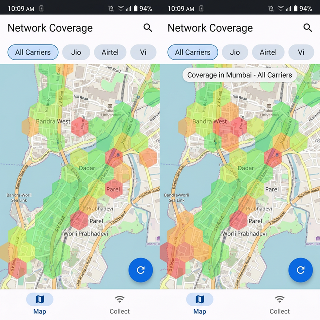
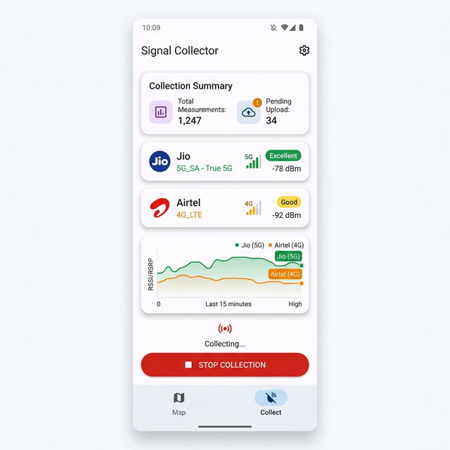
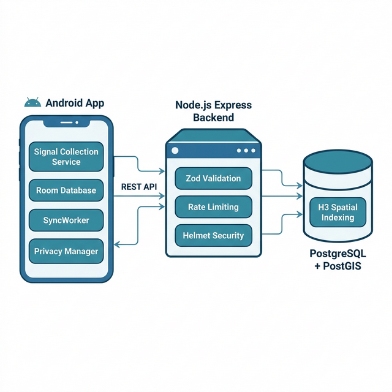

<div align="center">

# 📡 Virtual Coverage Map — India

### AI-Powered Crowdsourced Mobile Network Signal Strength Analysis

[](https://kotlinlang.org)
[](https://developer.android.com)
[](https://nodejs.org)
[](https://www.postgresql.org)
[](LICENSE)

> *A "Google Maps for Signal Strength" — an independent, community-driven mobile network coverage map for India, powered entirely by crowdsourced data from real users.*

---

</div>

## 📋 Table of Contents

- [Overview](#-overview)
- [Screenshots](#-screenshots)
- [System Architecture](#-system-architecture)
- [Features](#-features)
- [Tech Stack](#-tech-stack)
- [Project Structure](#-project-structure)
- [Getting Started](#-getting-started)
- [API Endpoints](#-api-endpoints)
- [Database Schema](#-database-schema)
- [Privacy & Compliance](#-privacy--compliance-dpdp-act-2023)
- [Testing](#-testing)
- [Roadmap](#-roadmap)
- [Contributing](#-contributing)
- [License](#-license)

---

## 🌟 Overview

**Virtual Coverage Map** is a full-stack mobile application that crowdsources mobile network signal strength data across India. It empowers everyday Android users to passively contribute real-world cellular coverage data — including **5G (SA & NSA)**, **4G LTE**, and **2G/3G GSM** — simply by installing the app.

### 🎯 Business Objectives

| Objective | Description |
|---|---|
| **Transparent Coverage** | Build an independent, user-driven map showing *actual* signal quality — not carrier marketing claims |
| **Carrier Comparison** | Let consumers compare Jio, Airtel, Vi, BSNL side-by-side in any neighborhood |
| **India-First Focus** | Address the gap in granular coverage data for tier-2/tier-3 cities and rural India |
| **Privacy by Design** | Full DPDP Act 2023 compliance — zero personal identifiers leave the device |

### 📊 Current Status

- **9 of 10 milestones complete (~90%)**
- Full end-to-end pipeline operational: **Phone → Local DB → SyncWorker → Backend API → PostgreSQL**
- **343+ real signal measurements** synced from physical devices
- Tested on **realme RMX3430** (Android 13) with real SIM cards

---

## 📱 Screenshots

<div align="center">

### Coverage Heatmap



*Interactive map with H3 hexagonal cells color-coded by signal quality. Filter by carrier (Jio, Airtel, Vi) using chip buttons.*

---

### Signal Collection Dashboard



*Real-time signal stats, per-carrier quality indicators (5G SA/NSA detection), and collection controls.*

</div>

---

## 🏗️ System Architecture

<div align="center">



</div>

```
┌─────────────────────────────┐      REST API       ┌──────────────────────────┐
│       📱 Android App         │ ──────────────────► │   🖥️ Node.js Backend     │
│                              │    POST /ingest     │                          │
│  ┌─────────────────────┐    │                      │  ┌────────────────────┐  │
│  │ Signal Collection    │    │                      │  │ Zod Validation     │  │
│  │ Service (Foreground) │    │                      │  │ Rate Limiting      │  │
│  └────────┬─────────────┘    │                      │  │ Helmet Security    │  │
│           │                  │                      │  └────────┬───────────┘  │
│  ┌────────▼─────────────┐    │                      │           │              │
│  │ Privacy Manager       │    │                      │  ┌────────▼───────────┐  │
│  │ • H3 Indexing         │    │                      │  │  PostgreSQL 18     │  │
│  │ • Device ID Hashing   │    │                      │  │  + PostGIS         │  │
│  │ • Home Location Fuzz  │    │                      │  │  + H3 Aggregation  │  │
│  └────────┬─────────────┘    │                      │  └────────────────────┘  │
│           │                  │                      │                          │
│  ┌────────▼─────────────┐    │                      └──────────────────────────┘
│  │ Room Database         │    │
│  │ (Offline-first)       │    │
│  └────────┬─────────────┘    │
│           │                  │
│  ┌────────▼─────────────┐    │
│  │ SyncWorker            │    │
│  │ (Every 15 min)        │    │
│  └───────────────────────┘    │
└─────────────────────────────┘
```

The app follows **Clean Architecture** with **MVVM** (Model-View-ViewModel):

```
presentation/       → Activities, Fragments, ViewModels (UI layer)
domain/usecase/      → Business logic (PrivacyManager)
data/repository/     → Repository abstraction
data/local/          → Room database, DAOs, entities
data/remote/         → Retrofit API service + DTOs
service/             → Android foreground service
sync/                → WorkManager SyncWorker
util/                → Pure-Kotlin H3 implementation
di/                  → Hilt DI modules
```

---

## ✨ Features

### 📡 Background Signal Collection
- Runs as an Android **foreground service** (persists across app closure)
- Collects signal data every **10 seconds** automatically
- Zero user interaction required after initial setup
- `START_STICKY` ensures OS restarts the service after kills

### 📱 Dual-SIM Support
- Detects all active SIMs via `SubscriptionManager`
- Creates per-SIM `TelephonyManager` instances
- Captures **both carriers simultaneously** — critical in India's dual-SIM market
- Records carrier name and subscription ID per measurement

### 🔮 5G Network Intelligence (SA vs. NSA)
- Distinguishes **True 5G Standalone (SA)** from **5G Non-Standalone (NSA)**
- SA detection: both `dataNetworkType` and `voiceNetworkType` are `NETWORK_TYPE_NR`
- NSA detection: data on NR but voice anchored on LTE
- Helps users identify genuine 5G coverage vs. marketed "5G"

### 🌐 Multi-Generation Network Support

| Network | Android Class | Metrics Captured |
|---|---|---|
| **5G NR** | `CellInfoNr` | SS-RSRP, SS-SINR, CSI-RSRP, PCI, TAC, NCI |
| **4G LTE** | `CellInfoLte` | RSRP, RSRQ, SINR, PCI, TAC, CI |
| **2G/3G GSM** | `CellInfoGsm` | dBm, ASU Level, LAC, CID |

### 🗺️ Interactive Coverage Heatmap
- **H3 hexagonal cells** overlaid on OpenStreetMap (osmdroid)
- Color-coded signal quality:
  - 🟢 **Green** — Excellent (> -70 dBm)
  - 🟡 **Lime** — Good (-70 to -85 dBm)
  - 🟠 **Orange** — Fair (-85 to -100 dBm)
  - 🔴 **Red** — Poor (< -100 dBm)
- Tap hexagons for details (avg RSRP, sample count, quality label)
- **Carrier filtering** via Material ChipGroup

### 📊 Live Signal Dashboard
- Real-time total measurements count
- Pending upload indicator
- Per-carrier signal quality with human-readable ratings
- Start/Stop collection controls

### 🔒 Privacy Protection (DPDP Act 2023)
- **SHA-256 hashed** device IDs with salt — raw IDs never leave device
- **H3 hexagonal indexing** replaces exact GPS coordinates
- **Home location fuzzing**: Resolution drops from room-level (Res 11) to neighborhood-level (Res 9) during nighttime (10 PM – 6 AM)
- Zero personal identifiers transmitted

### 💾 Offline-First Architecture
- All data stored in **Room database** locally
- Works in zero-connectivity areas (common in rural India)
- `isSynced` flag tracks upload status per record
- No data point is ever lost

### 🔄 Automated Background Sync
- **WorkManager** schedules uploads every **15 minutes**
- Network-aware — only syncs when connected
- **Exponential backoff** on failures
- Batch uploads of **100 measurements** at a time
- **Self-cleaning**: removes synced data older than 7 days

---

## 🛠️ Tech Stack

### Android App

| Technology | Version | Purpose |
|---|---|---|
| **Kotlin** | 1.9.22 | Primary language |
| **Android SDK** | 29–35 (Android 10 – 15) | Platform target |
| **Dagger Hilt** | 2.51 | Dependency injection |
| **Room** | 2.6.1 | SQLite abstraction + compile-time query validation |
| **Retrofit + OkHttp** | 2.9.0 / 4.12.0 | HTTP client for backend communication |
| **WorkManager** | 2.9.0 | Background sync scheduling |
| **osmdroid** | 6.1.18 | OpenStreetMap tiles (no API key required) |
| **Play Services Location** | 21.1.0 | FusedLocationProvider for GPS |
| **Material Components** | 1.11.0 | UI (Cards, Chips, FAB, BottomNav) |
| **Kotlin Coroutines** | 1.8.0 | Structured concurrency |
| **H3Android** | Custom | Pure-Kotlin H3 hexagonal indexing |
| **KSP** | 1.9.22-1.0.17 | Annotation processing |

### Backend

| Technology | Version | Purpose |
|---|---|---|
| **Node.js + TypeScript** | Latest | Type-safe server runtime |
| **Express** | 5.2.1 | HTTP server + routing |
| **PostgreSQL** | 18 | Primary database |
| **PostGIS** | Latest | Spatial queries (`ST_DWithin`, `GEOGRAPHY`) |
| **Zod** | 4.3.6 | Runtime request validation |
| **Helmet** | 8.1.0 | HTTP security headers |
| **express-rate-limit** | 8.2.1 | Abuse prevention |
| **pg** | 8.18.0 | PostgreSQL client |

---

## 📂 Project Structure

```
AI-Network-Strength-Analysis-India/
│
├── 📱 android-app/
│   ├── app/
│   │   ├── src/main/
│   │   │   ├── java/com/virtualcoverage/signalmap/
│   │   │   │   ├── SignalMapApp.kt                 # @HiltAndroidApp + WorkManager config
│   │   │   │   ├── di/
│   │   │   │   │   ├── DatabaseModule.kt           # Room DB + DAO providers
│   │   │   │   │   └── NetworkModule.kt            # OkHttp + Retrofit providers
│   │   │   │   ├── data/
│   │   │   │   │   ├── local/
│   │   │   │   │   │   ├── SignalDatabase.kt       # Room @Database (v1)
│   │   │   │   │   │   ├── dao/SignalMeasurementDao.kt     # 12+ query methods
│   │   │   │   │   │   └── entity/SignalMeasurementEntity.kt  # 23-column entity
│   │   │   │   │   ├── remote/
│   │   │   │   │   │   └── SignalApiService.kt     # Retrofit API + DTOs
│   │   │   │   │   └── repository/SignalRepository.kt
│   │   │   │   ├── domain/
│   │   │   │   │   └── usecase/PrivacyManager.kt   # DPDP compliance, H3, hashing
│   │   │   │   ├── presentation/
│   │   │   │   │   ├── MainActivity.kt             # Single Activity, bottom nav
│   │   │   │   │   ├── collect/CollectFragment.kt  # Signal stats + controls
│   │   │   │   │   └── map/
│   │   │   │   │       ├── MapFragment.kt          # osmdroid + H3 hex rendering
│   │   │   │   │       └── MapViewModel.kt         # Heatmap data management
│   │   │   │   ├── service/
│   │   │   │   │   └── SignalCollectionService.kt  # Foreground service (479 LOC)
│   │   │   │   ├── sync/
│   │   │   │   │   └── SyncWorker.kt               # Background data upload
│   │   │   │   └── util/
│   │   │   │       └── H3Android.kt                # Pure-Kotlin H3 implementation
│   │   │   ├── res/layout/
│   │   │   │   ├── activity_main.xml
│   │   │   │   ├── fragment_map.xml
│   │   │   │   └── fragment_collect.xml
│   │   │   └── AndroidManifest.xml                 # 8 permissions
│   │   └── build.gradle.kts
│   ├── build.gradle.kts
│   └── settings.gradle.kts
│
├── 🖥️ backend/
│   ├── src/
│   │   ├── server.ts                               # Express app + startup
│   │   ├── config.ts                               # Environment variables
│   │   ├── db.ts                                   # PostgreSQL connection pool
│   │   ├── migrations.ts                           # Auto-run schema creation
│   │   ├── schemas.ts                              # Zod validation schemas
│   │   └── routes/signal.ts                        # API handlers (354 LOC)
│   ├── package.json
│   ├── tsconfig.json
│   └── .env.example
│
├── 📄 Technical_Implementation.md                   # Detailed technical report
├── 📄 NonTechnical_Status.md                        # Business status report
└── 📸 screenshots/                                  # App screenshots
```

---

## 🚀 Getting Started

### Prerequisites

- **Android Studio** Ladybug or later
- **JDK 17**
- **Node.js** v18+ and **npm**
- **PostgreSQL 18** with **PostGIS** extension
- A physical Android device (Android 10+) with SIM card(s)

### 1. Clone the Repository

```bash
git clone https://github.com/YOUR_USERNAME/AI-Network-Strength-Analysis-India.git
cd AI-Network-Strength-Analysis-India
```

### 2. Backend Setup

```bash
cd backend

# Install dependencies
npm install

# Configure environment
cp .env.example .env
# Edit .env with your PostgreSQL credentials:
#   DB_HOST=localhost
#   DB_PORT=5432
#   DB_USER=your_user
#   DB_PASSWORD=your_password
#   DB_NAME=virtualcoverage
#   PORT=3000

# Run database migrations
npm run migrate

# Start development server
npm run dev
```

The server will start on `http://localhost:3000`. Verify with:
```bash
curl http://localhost:3000/health
```

### 3. Android App Setup

1. Open `android-app/` in **Android Studio**
2. Wait for Gradle sync to complete
3. Update the backend URL in `di/NetworkModule.kt`:
   ```kotlin
   private const val BASE_URL = "http://YOUR_LOCAL_IP:3000"
   ```
4. Connect a physical Android device via USB (enable USB debugging)
5. Click **Run** ▶️ or:
   ```bash
   ./gradlew installDebug
   ```
6. Grant all requested permissions (Location, Phone State, Notifications)
7. Signal collection starts automatically! 🎉

---

## 🌐 API Endpoints

| Method | Endpoint | Description |
|---|---|---|
| `POST` | `/api/v1/ingest/signal` | Batch ingest up to 500 measurements |
| `GET` | `/api/v1/heatmap` | H3-aggregated signal data for a bounding box |
| `GET` | `/api/v1/stats` | Per-carrier measurement counts and averages |
| `GET` | `/api/v1/carriers` | List all carriers with measurement counts |
| `GET` | `/api/v1/hexagon/:h3Index` | Detailed measurements for a specific H3 cell |
| `GET` | `/api/v1/nearby` | PostGIS proximity search (`ST_DWithin`) |
| `GET` | `/health` | Server + database health check |

### Example: Batch Ingest

```bash
curl -X POST http://localhost:3000/api/v1/ingest/signal \
  -H "Content-Type: application/json" \
  -d '{
    "device_id": "abc123",
    "measurements": [{
      "timestamp": 1708300800000,
      "carrier_name": "Jio",
      "network_type": "5G_SA",
      "ss_rsrp": -78,
      "ss_sinr": 15,
      "h3_index": "891ead4c553ffff",
      "h3_index_res9": "891ead4c553ffff",
      "latitude": 19.0760,
      "longitude": 72.8777,
      "hashed_device_id": "a1b2c3...",
      "device_model": "realme RMX3430",
      "android_version": 33
    }]
  }'
```

### Example: Get Heatmap Data

```bash
curl "http://localhost:3000/api/v1/heatmap?minLat=18.9&maxLat=19.2&minLng=72.7&maxLng=73.0"
```

---

## 🗃️ Database Schema

### `signal_measurements` Table (26 columns)

| Column | Type | Description |
|---|---|---|
| `id` | `BIGSERIAL` PK | Auto-increment primary key |
| `timestamp` | `TIMESTAMPTZ` | Measurement time |
| `carrier_name` | `VARCHAR` | e.g., "Jio", "Airtel" |
| `network_type` | `VARCHAR` | `5G_SA`, `5G_NSA`, `4G_LTE`, `2G_GSM` |
| `rsrp` | `INT` | LTE Reference Signal Received Power (dBm) |
| `rsrq` | `INT` | LTE Reference Signal Received Quality (dB) |
| `sinr` | `INT` | LTE Signal-to-Interference-plus-Noise Ratio |
| `ss_rsrp` | `INT` | 5G NR Synchronization Signal RSRP |
| `ss_sinr` | `INT` | 5G NR SS-SINR |
| `csi_rsrp` | `INT` | 5G NR Channel State Information RSRP |
| `dbm` | `INT` | GSM signal strength |
| `pci` | `INT` | Physical Cell ID |
| `tac` | `INT` | Tracking Area Code |
| `h3_index` | `VARCHAR` | H3 Resolution 11 (~0.003 km²) |
| `h3_index_res9` | `VARCHAR` | H3 Resolution 9 (~0.1 km²) |
| `latitude` | `DOUBLE` | GPS latitude |
| `longitude` | `DOUBLE` | GPS longitude |
| `location` | `GEOGRAPHY` | PostGIS POINT(lng, lat) — auto-populated |
| `hashed_device_id` | `VARCHAR` | SHA-256 anonymized device ID |
| `device_model` | `VARCHAR` | e.g., "realme RMX3430" |
| `android_version` | `INT` | API level |

**Indexes:** `h3_index`, `h3_index_res9`, `carrier_name + timestamp`, `hashed_device_id`, `batch_id`

**Materialized View:** `signal_stats` — pre-aggregated carrier statistics for fast reads.

---

## 🔒 Privacy & Compliance (DPDP Act 2023)

This project takes user privacy seriously and is designed to comply with India's **Digital Personal Data Protection Act, 2023**.

### Three Layers of Privacy Protection

```
Layer 1: Device ID Anonymization
    ANDROID_ID → SHA-256 + salt → hashed_device_id
    ✅ Raw device IDs NEVER leave the phone

Layer 2: Spatial Anonymization (H3 Hexagonal Indexing)
    GPS Coordinates → H3 Cell ID (hex grid)
    ✅ Exact addresses are replaced with zone identifiers

Layer 3: Temporal Privacy (Home Location Fuzzing)
    Nighttime (10 PM – 6 AM): Resolution 9 (~neighborhood)
    Daytime (6 AM – 10 PM):   Resolution 11 (~room-level)
    ✅ Prevents home address inference from dense data clusters
```

### Why Pure-Kotlin H3?

The standard `com.uber:h3:4.1.1` Java library uses JNI native code (`libh3-java.so`) that does not ship ARM64 binaries for Android, causing fatal `UnsatisfiedLinkError` crashes on all physical devices. We wrote **`H3Android.kt`** — a pure-Kotlin reimplementation — to eliminate this dependency entirely.

---

## 🧪 Testing

### Unit Tests

```bash
cd android-app
./gradlew test
```

| Test Suite | File | Coverage |
|---|---|---|
| **H3 Indexing** | `H3AndroidTest.kt` | Coordinate → H3 conversion, boundary generation |
| **Privacy Manager** | `PrivacyManagerTest.kt` | Device ID hashing, home fuzzing, nighttime logic |
| **Signal Quality** | `SignalQualityTest.kt` | RSRP → quality label mapping |
| **SyncWorker DTO** | `SyncWorkerDtoMappingTest.kt` | Entity → API DTO field mapping |
| **DPDP Compliance** | `DpdpComplianceTest.kt` | Anonymization, data minimization validation |
| **Performance** | `PerformanceTest.kt` | Throughput and latency benchmarks |

### Manual Testing

```bash
# Monitor signal collection in real time
adb logcat -s SignalCollectionService

# Check backend health
curl http://localhost:3000/health
```

---

## 🗺️ Roadmap

- [x] Background signal collection engine
- [x] Dual-SIM support
- [x] 5G SA vs. NSA detection
- [x] Multi-generation network support (5G/4G/2G)
- [x] Interactive H3 hexagonal heatmap
- [x] Live signal dashboard
- [x] DPDP Act 2023 privacy compliance
- [x] Offline-first local storage
- [x] Backend API (Node.js + PostgreSQL + PostGIS)
- [x] Automated background sync (WorkManager)
- [ ] Carrier comparison UI (side-by-side analysis)
- [ ] Cloud deployment (Railway / Render / AWS)
- [ ] Google Play Store listing
- [ ] Firebase Crashlytics integration
- [ ] ProGuard / R8 configuration for release builds
- [ ] Web dashboard for public coverage map

---

## 🤝 Contributing

Contributions are welcome! Here's how to get started:

1. **Fork** the repository
2. Create a feature branch: `git checkout -b feature/amazing-feature`
3. Commit your changes: `git commit -m 'Add amazing feature'`
4. Push to the branch: `git push origin feature/amazing-feature`
5. Open a **Pull Request**

### Coding Standards

- **Android:** Kotlin with KtLint, Clean Architecture + MVVM
- **Backend:** TypeScript with strict mode, Zod for runtime validation
- **Commits:** Use conventional commit messages

---

## 📜 License

This project is licensed under the **ISC License** — see the [LICENSE](LICENSE) file for details.

---

## 👥 Authors

**Virtual Coverage Map Team**

---

<div align="center">

### 🇮🇳 Built for India, by India

*Making mobile network transparency a reality — one signal measurement at a time.*

⭐ **Star this repo** if you find it useful!

</div>
